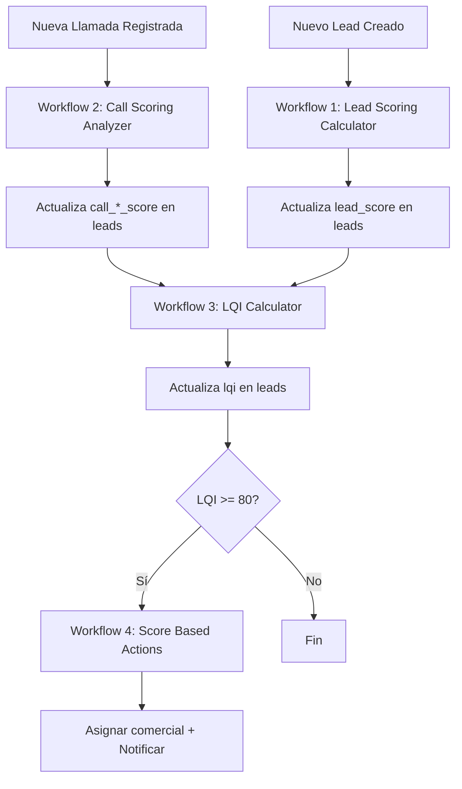

# 📊 Workflows de Lead Scoring para n8n

Este directorio contiene los 4 workflows necesarios para implementar el sistema completo de Lead Scoring en Autocall.

## 📦 Workflows Incluidos

### 1️⃣ Lead Scoring Calculator
**Archivo:** `1-lead-scoring-calculator.json`
**Webhook URL:** `http://localhost:5678/webhook/calculate-lead-score`
**Descripción:** Calcula el score general del lead (0-100) basándose en:
- Información completa del lead (25 pts)
- Engagement e interacciones (30 pts)
- Recencia de actividad (20 pts)
- Consentimiento y opt-in (15 pts)
- Estado actual del lead (10 pts)

**Categorías resultantes:**
- 🔥 Muy Caliente (80-100)
- 🌡️ Caliente (60-79)
- 🌤️ Tibio (40-59)
- ❄️ Frío (0-39)

---

### 2️⃣ Call Scoring Analyzer
**Archivo:** `2-call-scoring-analyzer.json`
**Webhook URL:** `http://localhost:5678/webhook/analyze-call-score`
**Descripción:** Analiza la calidad de cada llamada y calcula scores específicos:
- Response Score (25 pts) - Si respondió o no
- Duration Score (25 pts) - Duración de la llamada
- Interaction Score (25 pts) - Calidad de la interacción
- Behavior Score (25 pts) - Comportamiento del lead

**Categorías resultantes:**
- ⭐ Excelente (80-100)
- ✅ Buena (60-79)
- 📊 Regular (40-59)
- ⚠️ Baja (0-39)

**Trigger automático:** Se ejecuta automáticamente cada vez que se registra una llamada.

---

### 3️⃣ LQI Calculator (Lead Quality Index)
**Archivo:** `3-lqi-calculator.json`
**Webhook URL:** `http://localhost:5678/webhook/calculate-lqi`
**Descripción:** Calcula el índice de calidad combinado del lead.

**Fórmula:**
```
LQI = (lead_score × 0.4) + (call_total_score × 0.4) +
      (intentos_compra × 10) + (tasa_exito × 0.2) +
      bonus_actividad + bonus_engagement
```

**Categorías resultantes:**
- 💎 Premium (80-100) - Asignación inmediata
- 🥇 Alto (65-79) - Seguimiento prioritario
- 🥈 Medio (45-64) - Seguimiento regular
- 🥉 Bajo (25-44) - Seguimiento automatizado
- ⚫ Muy Bajo (0-24) - Considerar descarte

---

### 4️⃣ Score Based Action Trigger
**Archivo:** `4-score-based-actions.json`
**Webhook URL:** `http://localhost:5678/webhook/high-priority-lead`
**Descripción:** Ejecuta acciones automáticas según el score del lead.

**Acciones por categoría:**

**Premium (LQI ≥ 80):**
- ✅ Prioridad máxima (5)
- ✅ Asignación a comercial senior
- ✅ Notificación urgente a Slack
- ✅ Seguimiento en 2h

**Alto (LQI 65-79):**
- ✅ Prioridad alta (4)
- ✅ Seguimiento en 48h
- ✅ Asignación a comercial disponible

**Medio (LQI 45-64):**
- ✅ Prioridad media (3)
- ✅ Seguimiento semanal
- ✅ Gestión regular

**Bajo (LQI < 45):**
- ✅ Prioridad baja (2)
- ✅ Cambio a canal WhatsApp
- ✅ Análisis de estrategia alternativa

---

## 🚀 Cómo Importar los Workflows en n8n

### Paso 1: Acceder a n8n
```bash
# Si usas Docker
docker-compose up -d n8n

# Acceder a n8n
http://localhost:5678
```

### Paso 2: Importar Workflow
1. En n8n, haz clic en el menú superior derecho
2. Selecciona **"Import from File"**
3. Selecciona el archivo JSON del workflow (ejemplo: `1-lead-scoring-calculator.json`)
4. Haz clic en **"Import"**

### Paso 3: Configurar Credenciales de PostgreSQL
**IMPORTANTE:** Todos los workflows necesitan conexión a PostgreSQL.

1. Ve a **Settings > Credentials**
2. Haz clic en **"+ New Credential"**
3. Busca **"PostgreSQL"**
4. Configura:
   ```
   Host: tu-host-postgres (ej: localhost o IP)
   Database: auto_call
   User: tu-usuario
   Password: tu-contraseña
   Port: 5432
   ```
5. Haz clic en **"Create"**

### Paso 4: Asignar Credenciales a los Nodos
Para cada workflow importado:
1. Abre el workflow
2. Haz clic en cada nodo de PostgreSQL (hay varios por workflow)
3. En el campo **"Credential to connect with"**, selecciona las credenciales que creaste
4. Haz clic en **"Save"**

### Paso 5: Activar los Workflows
1. Haz clic en el botón **"Activate"** en la esquina superior derecha
2. Los webhooks ahora estarán activos y listos para recibir peticiones

---

## 🔗 Flujo de Ejecución



---

## 📊 Webhooks y URLs

Una vez importados y activados, tendrás las siguientes URLs disponibles:

| Workflow | Webhook URL | Método | Body Esperado |
|----------|-------------|--------|---------------|
| **Lead Scoring Calculator** | `http://localhost:5678/webhook/calculate-lead-score` | POST | `{ "lead_id": "uuid" }` |
| **Call Scoring Analyzer** | `http://localhost:5678/webhook/analyze-call-score` | POST | `{ "call_id": "uuid" }` |
| **LQI Calculator** | `http://localhost:5678/webhook/calculate-lqi` | POST | `{ "lead_id": "uuid" }` |
| **Score Based Actions** | `http://localhost:5678/webhook/high-priority-lead` | POST | `{ "lead_id": "uuid", "lqi": 85, "categoria_lqi": "premium" }` |

---

## 🧪 Testing de los Workflows

### Prueba Manual desde n8n
1. Abre el workflow que quieres probar
2. Haz clic en el nodo "Webhook Trigger"
3. Haz clic en "Listen for Test Event"
4. Usa curl o Postman para enviar una petición:

```bash
# Probar Lead Scoring Calculator
curl -X POST http://localhost:5678/webhook/calculate-lead-score \
  -H "Content-Type: application/json" \
  -d '{"lead_id": "tu-lead-id-real"}'

# Probar Call Scoring Analyzer
curl -X POST http://localhost:5678/webhook/analyze-call-score \
  -H "Content-Type: application/json" \
  -d '{"call_id": "tu-call-id-real"}'

# Probar LQI Calculator
curl -X POST http://localhost:5678/webhook/calculate-lqi \
  -H "Content-Type: application/json" \
  -d '{"lead_id": "tu-lead-id-real"}'
```

### Prueba desde Autocall Backend
En tu código de Autocall, cuando registres una llamada:

```javascript
// Después de insertar en call_logs
await fetch('http://localhost:5678/webhook/analyze-call-score', {
  method: 'POST',
  headers: { 'Content-Type': 'application/json' },
  body: JSON.stringify({ call_id: newCall.call_id })
});
```

---

## 🛠️ Configuración Adicional

### Variables de Entorno en n8n

Algunas acciones necesitan variables de entorno:

1. **Notificaciones Slack:**
   ```bash
   SLACK_WEBHOOK_URL=https://hooks.slack.com/services/TU/WEBHOOK/URL
   ```

2. **URLs de Autocall:**
   ```bash
   AUTOCALL_API_URL=http://localhost:3000/api
   ```

Para configurar en Docker:
```yaml
# docker-compose.yml
services:
  n8n:
    environment:
      - SLACK_WEBHOOK_URL=tu-webhook-url
      - AUTOCALL_API_URL=http://autocall-api:3000/api
```

---

## 🔧 Personalización

### Ajustar Umbrales de Scoring

Para cambiar los umbrales de categorización, edita el código JavaScript en los nodos "Calculate":

**Lead Scoring Calculator:**
```javascript
// Ubicación: Nodo "Calculate Base Score"
if (score >= 85) calidadLead = 'muy_caliente';      // Cambiar 85
else if (score >= 65) calidadLead = 'caliente';     // Cambiar 65
else if (score >= 40) calidadLead = 'tibio';        // Cambiar 40
```

**LQI Calculator:**
```javascript
// Ubicación: Nodo "Calculate LQI"
if (lqi >= 85) categoriaLqi = 'premium';            // Cambiar 85
else if (lqi >= 70) categoriaLqi = 'alto';          // Cambiar 70
else if (lqi >= 50) categoriaLqi = 'medio';         // Cambiar 50
```

### Añadir Más Factores de Scoring

En cualquier nodo de código JavaScript, puedes añadir más criterios:

```javascript
// Ejemplo: Añadir puntos por referencia
if (lead.fuente === 'referido') {
  score += 10;
  breakdown.referencia = 10;
}

// Ejemplo: Bonificar leads de ciertas ciudades
if (['Madrid', 'Barcelona', 'Valencia'].includes(lead.ciudad)) {
  score += 5;
  breakdown.ciudad_premium = 5;
}
```

---

## 🐛 Troubleshooting

### Error: "Cannot connect to database"
**Solución:** Verifica las credenciales de PostgreSQL en n8n.

### Error: "Webhook not found"
**Solución:** Asegúrate de que el workflow está activado (toggle en ON).

### Workflow no se ejecuta automáticamente
**Solución:**
- Verifica que el webhook está siendo llamado correctamente desde tu código
- Revisa los logs de n8n: Settings > Log Streaming

### Campos null en breakdown
**Solución:** Algunos campos pueden estar vacíos si el lead no tiene datos suficientes. Esto es normal.

---

## 📈 Monitoreo

### Ver Ejecuciones en n8n
1. Ve a **Executions** en el menú lateral
2. Filtra por workflow
3. Haz clic en una ejecución para ver los detalles

### Métricas Importantes
- **Tasa de éxito:** % de ejecuciones exitosas
- **Tiempo promedio:** Tiempo que tarda cada workflow
- **Errores comunes:** Identificar problemas recurrentes

---

## 📚 Recursos Adicionales

- [Documentación de n8n](https://docs.n8n.io/)
- [Documentación de PostgreSQL](https://www.postgresql.org/docs/)
- [Scripts SQL de la implementación](../sql/)
- [Documentación de la API de Autocall](../../server/docs/)

---

## ✅ Checklist de Implementación

- [ ] Todos los workflows importados
- [ ] Credenciales de PostgreSQL configuradas
- [ ] Workflows activados
- [ ] Testing manual realizado con éxito
- [ ] Integración con Autocall backend completada
- [ ] Variables de entorno configuradas
- [ ] Notificaciones funcionando (si aplica)
- [ ] Documentación leída y entendida

---

## 🆘 Soporte

Si encuentras problemas:
1. Revisa los logs de n8n
2. Verifica la consola de PostgreSQL
3. Comprueba que los IDs de leads/calls existen en la base de datos
4. Consulta la documentación oficial de n8n

---

**Última actualización:** 2025-11-14
**Versión de workflows:** 1.0.0
**Compatible con:** n8n v1.0+
